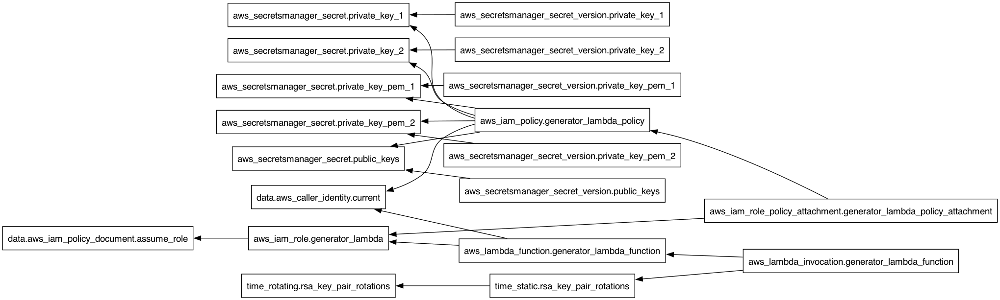

# IaC Snowflake User RSA key pairs Rotation Terraform module
Last updated: 2025-07-23

This Terraform [module](https://developer.hashicorp.com/terraform/language/modules) offers a robust and automated solution for managing the entire lifecycle of [RSA key pairs](https://github.com/j3-signalroom/j3-techstack-lexicon/blob/main/cryptographic-glossary.md#rsa-key-pair) used to authenticate a Snowflake service account. It leverages the Infrastructure-as-Code (IaC) approach with a specialized AWS Lambda function, known as the [IaC Snowflake User RSA key pairs and JWT Generator](https://github.com/j3-signalroom/iac-snowflake-user-rsa_key_pairs_and_jwt_generator-lambda), to automate the generation and rotation of RSA key pairs. The module allows users to define rotation intervals (e.g., every 30 days since the last key generation) to enhance security by regularly renewing cryptographic credentials. Additionally, it integrates seamlessly with AWS Secrets Manager to securely store and manage the generated key pairs, ensuring that the keys remain protected and easily accessible for Snowflake authentication without manual intervention.

Overall, this module is a vital tool for maintaining a secure, efficient, and automated RSA key management process in cloud environments that utilize Snowflake.

> _Snowflake currently enforces a limit of two active RSA key pairs per user account. This restriction is designed to facilitate secure key rotation practices, allowing one key pair to be used actively while the other is kept as a backup or prepared for future use. This dual-key setup ensures continuous access to the Snowflake account while maintaining high security standards by enabling periodic key renewal without downtime._

To customize this Terraform module for your specific requirements, you can utilize its configurable [input](https://developer.hashicorp.com/terraform/language/values/variables) and [output](https://developer.hashicorp.com/terraform/language/values/outputs) variables. These variables enable you to adjust key parameters such as the frequency of RSA key pair rotation, the details of the Snowflake user, and other settings relevant to your environment. This approach allows you to adapt the module's behavior to fit different operational needs without directly modifying its underlying code.

By using these variables, you can:
- **Set the Rotation Frequency**: Define how often RSA key pairs should be rotated, aligning with your organization's security policies.
- **Configure Snowflake User Details**: Specify attributes account names, or any other Snowflake-specific settings.
- **Adjust AWS Lambda Settings**: Customize Lambda function parameters, such as memory size and timeout, to optimize performance for your use case.

This flexibility makes the module highly reusable and easier to integrate into various Terraform configurations, enhancing composability and streamlining infrastructure management. It allows for quick adjustments to meet different security requirements or deployment scenarios, reducing the time and effort needed to maintain and adapt infrastructure as code (IaC) practices across multiple projects or environments.

**Table of Contents**

<!-- toc -->
+ [1.0 Let's get started!](#10-lets-get-started)
    - [1.1 Visualizing the Terraform Configuration](#11-visualizing-the-terraform-configuration)
+ [2.0 Resources](#20-resources)
<!-- tocstop -->

## 1.0 Let's get started!

> **Important Notice**
>
> _To ensure smooth operation and prevent potential disruptions when using Terraform with time-based rotation, it’s essential to run the module regularly within the specified rotation period. Specifically, the execution frequency should match or surpass the configured rotation interval for RSA key pairs. Missing this schedule risks deleting multiple key pairs in one cycle. This could potentially remove all active RSA keys, disrupting any processes that depend on older keys to access Snowflake resources. To maintain continuous access and functionality, it is crucial to keep the module execution timely and aligned with the rotation settings._

**These are the steps**

1. Take care of the cloud environment prequisities listed below:
    > You need to have the following cloud accounts:
    > - [AWS Account](https://signin.aws.amazon.com/) *with SSO configured*
    > - [GitHub Account](https://github.com) *with OIDC configured for AWS*
    > - [Terraform Cloud Account](https://app.terraform.io/)

2. Clone the repo:
    ```shell
    git clone https://github.com/j3-signalroom/iac-snowflake-user-rsa_key_pairs_rotation-tf_module.git
    ```

3. Update the cloned Terraform module's [main.tf](main.tf) by following these steps:

    a. Locate the `terraform.cloud` block and replace **`signalroom`** with your [Terraform Cloud Organization Name](https://developer.hashicorp.com/terraform/cloud-docs/users-teams-organizations/organizations).

    b. In the `terraform.cloud.workspaces` block, replace **`iac-snowflake-user-rsa-key-pairs-rotation-tf-module-workspace`** with your [Terraform Cloud Organization's Workspaces Name](https://developer.hashicorp.com/terraform/cloud-docs/workspaces).

4.  Deploy your Terraform module to GitHub by following these steps:

	a. **Commit your module:**  Ensure all changes to your Terraform module are committed to your local Git repository.

	b. **Push to GitHub:**  Push your committed changes to your GitHub repository.  This makes the module available for use in other projects.

	c. **Add a Module Block:**  In the Terraform configuration where you want to use the module, add a module block.  Inside this block, include the following:

	*Source*: Reference the GitHub repository URL where your module is stored.

	*Version*: Specify the appropriate branch, tag, or commit hash to ensure you’re using the correct version of the module.

    d. **Pass Input Variables:**  Within the same module block, pass the required input variables by defining them as key-value pairs:
    Input Variable|Description
    -|-
    `aws_region`|The AWS Region the Terraform configuration uses.
    `snowflake_account_identifier`|The Snowflake Account identifer issued to your organization.
    `service_account_user`|The Snowflake service account user who is to be assigned the RSA key pairs for its authentication.
    `day_count`|_**(Optional and defaults to 30 days)**_  How many day(s) should the RSA key pairs be rotated for.
    `aws_lambda_memory_size`|_**(Optional and defaults to 128 MB)**_  Lambda allocates CPU power in proportion to the amount of memory configured. Memory is the amount of memory available to your Lambda function at runtime. You can increase or decrease the memory and CPU power allocated to your function using the Memory setting. You can configure memory between 128 MB and 10,240 MB in 1-MB increments. At 1,769 MB, a function has the equivalent of one vCPU (one vCPU-second of credits per second).
    `aws_lambda_timeout`|_**(Optional and defaults to 900 seconds)**_  Lambda runs your code for a set amount of time before timing out. Timeout is the maximum amount of time in seconds that a Lambda function can run. The default value for this setting is 3 seconds, but you can adjust this in increments of 1 second up to a maximum value of 900 seconds (15 minutes).
    `aws_log_retention_in_days`|_**(Optional and defaults to 7 days)**_  Specifies the number of days you want to retain log events in the specified log group. Possible values are: 1, 3, 5, 7, 14, 30, 60, 90, 120, 150, 180, 365, 400, 545, 731, 1096, 1827, 2192, 2557, 2922, 3288, 3653, and 0. If you select 0, the events in the log group are always retained and never expire.

    e. **Output Variable(s):**  The output variable(s) enable data generated by the module to be exposed to the parent module (the configuration that calls the module), allowing the results of the module’s actions to be used elsewhere in the Terraform deployment.

    Output Variable|Description
    -|-
    `active_key_number`|Specifies current active RSA public key number.
    `secrets_path`|Specifies the root secrets path in AWS Secrets Manager where the RSA key pairs are stored.
    `rsa_public_key_pem_1`|Specifies the first RSA public key in PEM format.
    `rsa_public_key_pem_2`|Specifies the second RSA public key in PEM format.
    `snowflake_rsa_public_key_pem_1`|Specifies the first Snowflake RSA public key in PEM format.
    `snowflake_rsa_public_key_pem_2`|Specifies the second Snowflake RSA public key in PEM format.
    `snowflake_rsa_private_key_pem_1`|Specifies the first Snowflake RSA private key in PEM format.
    `snowflake_rsa_private_key_pem_2`|Specifies the second Snowflake RSA private key in PEM format.
    `snowflake_rsa_public_key_jwt_1`|Specifies the first Snowflake RSA public key in JWT format.
    `snowflake_rsa_public_key_jwt_2`|Specifies the second Snowflake RSA public key in JWT format.

### 1.1 Visualizing the Terraform Configuration
Below is the Terraform visualization of the Terraform configuration. It shows the resources and their dependencies, making the infrastructure setup easier to understand.



> **To fully view the image, open it in another tab on your browser to zoom in.**

When you update the Terraform Configuration, to update the Terraform visualization, use the [`terraform graph`](https://developer.hashicorp.com/terraform/cli/commands/graph) command with [Graphviz](https://graphviz.org/) to generate a visual representation of the resources and their dependencies.  To do this, run the following command:

```bash
terraform graph | dot -Tpng > .blog/images/terraform-visualization.png
```

## 2.0 Resources
[Snowflake key pair authentication and key pair rotation](https://docs.snowflake.com/en/user-guide/key-pair-auth)

[Terraform Resource `time_rotating`](https://registry.terraform.io/providers/hashicorp/time/latest/docs/resources/rotating.html)

[Terraform Hidden Gems! Secret Rotation with time_rotating](https://medium.com/cloud-native-daily/terraform-hidden-gems-secret-rotation-with-time-rotating-72ae8683ef7f)
